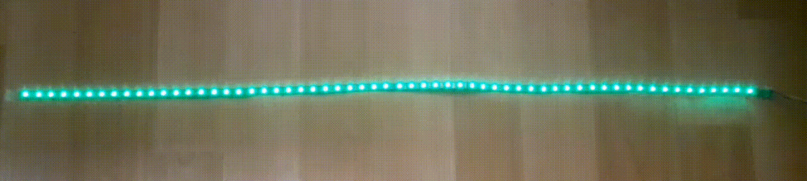
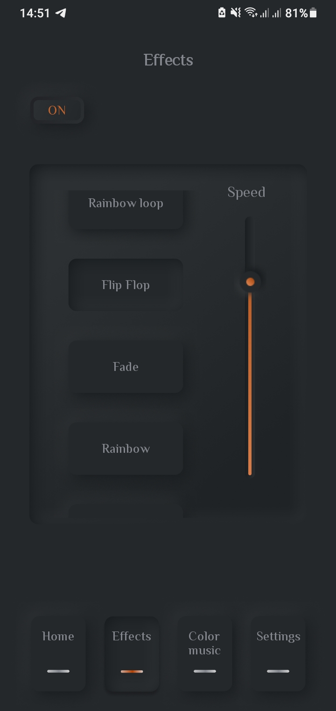

# Проект MyLed
## Оглавление
- Описание
- Элементная база
- Используемая периферия микроконтроллера
- Принцип работы
- Возможности контроллера
- Фото и видео демонстрации
____
## Описание
Данный проект представляет из себя контроллер и мобильное приложение для беспроводного управления адресной светодиодной лентой на микросхеме WS2812B. Главным управляющим органом является микроконтроллер STMF103C8T6. Упрваление осуществляется при помощи WI-FI сети (через точку доступа контроллера или через локальную сеть роутера).
____
## Элементная база
- отладочная плата на базе микроконтроллера STM32F103C8T6 (Blue pill)
- отладочная плата на базе микроконтроллера ESP8266 (ESP-01S)
- микрофонный модуль на базе микросхемы MAX9814
- модуль стабилизатора напряжения на базе микросхемы AMS1117 5-3.3
- адресная светодиодная лента на микросхеме WS2812B (1 - 5 метров)
- блок питания 5V 40W
____
## Используемая периферия микроконтроллера
- TIM1 и TIM3
- DMA
- UART1
- ADC1
- Flash память в качестве EEPROM
____
## Принцип работы
При включении контроллера производится начальная настройка периферии. Потом проверяется последняя страница Flash памяти на наличие в ней записи параметров ленты и модуля беспроводной связи, если там ничего не записано, то происходит инициализация по умолчанию. Дальше происходит инициализация ленты и модуля беспроводной связи в соответствии с сохраненными параметрами. Дальше идет бесконечный цикл в котором выполняется вывод информации на ленту при помощи DMA и TIM1 настроенного в режиме ШИМ. Данные с мобильного приложения принимаются с модуля беспроводной связи по прерыванию UARTа и эти параметры записываются во Flash память. В режиме цветомузыки ADC1 запускается по TIM3 с частотой 16кГц и считывает данные с микрофона. Полученные данные сохраняются в буфере, после чего производится БПФ и на основе выходных данных формируются эффекты цветомузыки.
____
## Возможности контроллера
- изменение цвета 
- изменение яркости 
- включение/выключение ленты
- выбор различных эффектов
    - изменение скорости анимации эффектов
- режимы цветомузыки
    - изменение скорости анимации цветомузыки
    - изменение чувствительности 3-х уровней частот звука
____
## Фото и видео демонстрации
### Эффекты
#### Rainbow Loop

#### Flip Flop

#### Fade

#### Rainbow

### Цветомузыка
#### Sectors

#### Running Leds

#### Flashing

### Макетка

### Скриншоты мобильного приложения

